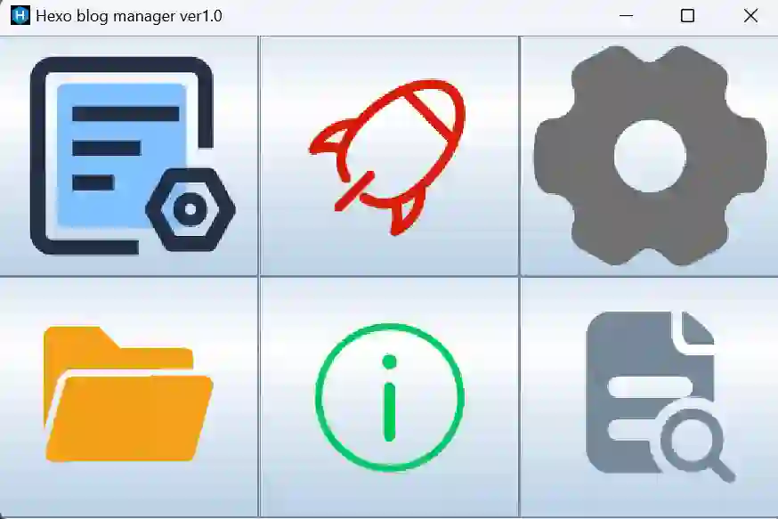

本文档帮助你更快上手 Hexo Blog Manager

## 实现的功能

- markdown文件管理
  - 显示markdown文件的名字，优先级
  - 自由查看和修改markdown文件的详细头部信息
  - 快捷新建markdown文件（及其对应的文件夹）
  - 删除markdown文件（及其对应的文件夹）

- 博客生成与部署

- 自动备份

> 更多功能待开发

## 使用方法

### 运行 Hexo Blog Manager

- 对于Hexo Blog Manager.jar

>要运行一个 .jar 文件，需要先安装 Java 运行时环境（JRE）。如果您没有安装 JRE，请从 Oracle 官方网站下载并安装。然后，按照以下步骤运行 Hexo Blog Manager.jar 文件：

1. 打开命令行或终端窗口，进入包含 Hexo Blog Manager.jar 文件的目录。
2. 在命令行或终端窗口中输入以下命令：`java -jar Hexo\ Blog\ Manager.jar`
3. 按下回车键即可启动应用程序。

请注意，在命令中，文件名包含空格的情况需要使用反斜杠进行转义。

- 对于Hexo Blog Manager.exe

要运行 .exe 文件，只需双击该文件即可启动应用程序。

### 用户界面介绍

该应用程序具有以下六个按钮：

从上到下，从左到右依次是：

- Markdown文件管理：管理Markdown文件。您可以创建、编辑、重命名和删除Markdown文件。
- Blog生成与部署：清除，
- 设置：通过此按钮，您可以更改博客路径。
- 打开blog文章目录：通过此按钮，您可以快速找到所有文章。
- 关于作者：查看应用程序的作者信息。
- 帮助文档：查看应用程序的帮助文档。

### Markdown文件管理

要管理Markdown文件，请单击“Markdown文件管理”按钮。在此页面中，您可以执行以下操作：

- 创建新的Markdown文件：请单击“新建”按钮，并在弹出的对话框中输入文件名。
- 编辑Markdown文件：请单击文件名，并在编辑器中编辑Markdown文件。
- 重命名Markdown文件：请单击文件名，在弹出的对话框中输入新的文件名。
- 删除Markdown文件：请单击文件名，在弹出的对话框中单击“删除”。

### Blog生成与部署

要生成和部署博客，请单击“Blog生成与部署”按钮。在此页面中，您可以执行以下操作：

- 生成博客：请单击“生成”按钮。在生成过程中，您可以看到进度条。生成完成后，您可以在博客根目录下找到生成的HTML文件。
- 部署博客：请单击“部署”按钮，并输入FTP服务器的相关信息。在部署过程中，您可以看到进度条。部署完成后，您可以在网上访问您的博客。

### 设置

要更改应用程序的设置，请单击“设置”按钮。在此页面中，您可以更改编辑器的主题和字体大小。

### 打开blog根目录

要打开博客的根目录，请单击“打开blog根目录”按钮。在该目录下，您可以找到博客的所有文件。

### 关于作者

要查看应用程序的作者信息，请单击“关于作者”按钮。

### 帮助文档

要查看应用程序的帮助文档，请单击“帮助文档”按钮。
