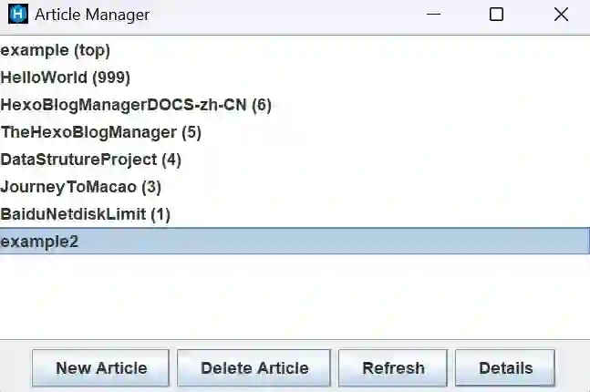
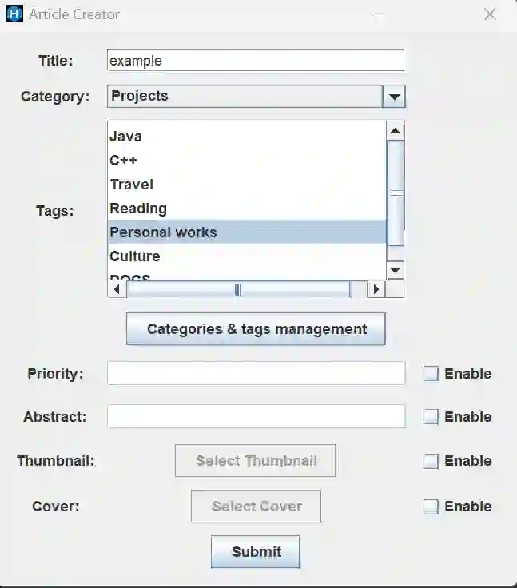
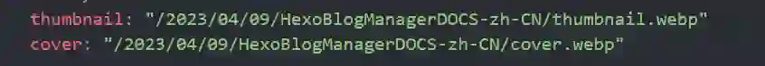
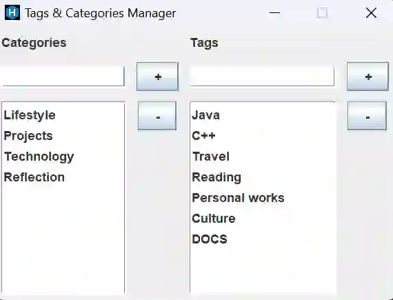
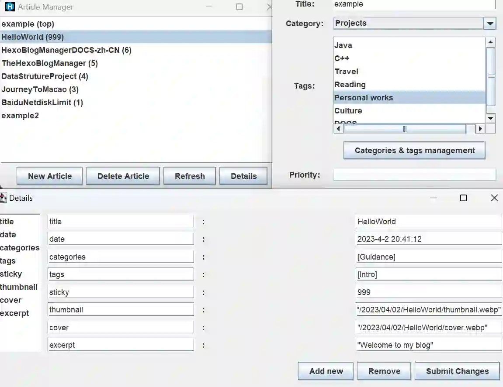
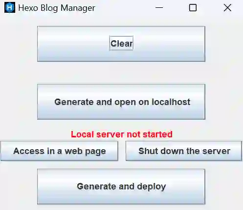

本文档帮助你更快上手 Hexo Blog Manager

## 实现的功能

- markdown文件管理
  - 显示markdown文件的名字，优先级
  - 自由查看和修改markdown文件的详细头部信息
  - 快捷新建markdown文件（及其对应的文件夹）
  - 删除markdown文件（及其对应的文件夹）

- 博客生成与部署

- 自动备份

> 更多功能待开发

## 使用方法

### 运行 Hexo Blog Manager

- 对于HexoBlogManager.jar

>要运行一个 .jar 文件，需要先安装 Java 运行时环境（JRE）。如果您没有安装 JRE，请从 Oracle 官方网站下载并安装。然后，按照以下步骤运行 Hexo Blog Manager.jar 文件：

**您可以直接双击jar文件打开。**

或者

1. 在终端中打开包含 HexoBlogManager.jar 文件的目录。
2. 在命令行或终端窗口中输入以下命令：`java -jar HexoBlogManager.jar`
3. 按下回车键即可启动应用程序。

- 对于Hexo Blog Manager.exe

**要运行 .exe 文件，只需双击该文件即可启动应用程序。**

### 使用条件

在使用前，您应该确保您的hexo能够成功执行`hexo clean` `hexo g` `hexo d`，否则可能会因为某些原因导致应用程序阻塞发生意外的错误。

### 用户界面介绍

该应用程序具有以下六个按钮：

从上到下，从左到右依次是：

- Markdown文件管理：管理Markdown文件。您可以创建、编辑、重命名和删除Markdown文件。
- Blog生成与部署：清除，
- 设置：通过此按钮，您可以更改博客路径。
- 打开blog文章目录：通过此按钮，您可以快速找到所有文章。
- 关于作者：查看应用程序的作者信息。
- 帮助文档：查看应用程序的帮助文档。

下面开始详细介绍各个部分

### Markdown文件管理

要管理Markdown文件，请单击“Markdown文件管理”按钮。在此页面中：

#### 文章管理面板

显示文章的文件名字，以及优先级(sticky)，此处显示的优先级和实际部署的几乎一样。显示的格式为`文章 (优先级)`，如果部分支持`top: true`的主题中的文章有top项目，那么top将会被排序在最前面。剩下不包含`top: true`的文章将根据优先级`sticky: num`从大到小排列，即按照sticky由大到小排序。如果部分文章没有`sticky: num`，那么这些文章将排序在最后。

>在下面这个例子中，example.md具有`top: true`属性，所以优先级最高，HelloWorld.md具有`sticky: 999`属性，值远大于其余的sticky值分别为（6，5，4，3，2，1，null），所以优先级高于sticky值较小或者没有的.md文件，example2.md没有`sticky: num`属性，所以优先级在最后。

#### 文章新建面板

单击“New Article”按钮以调出新建面板

- `Title`:文章的标题，为必填项
- `Category`:选择文章的类型，这里一个文章只能选择一个种类。以后可能会改成可选择多个种类，（但是这样似乎与tag没有差别）。
- `Tags`:选择文章的标签。按住ctrl单击鼠标左键以实现选择多项
>注意：某些主题有最多支持标签数量，如果超出了这个数量，那么不同主题会有不同的处理方式。
- `Priority`:即sticky，定义文章的优先级。如果将右边Enable勾选，则开启，否则不使用该标签。
- `Abstract`:即excerpt，定义文章的摘要。如果将右边Enable勾选，则开启，否则不使用该标签。
- `Thumbnail`:选择文章的略缩图。如果将右边Enable勾选，则开启，否则不使用该标签。
- `Cover`:选择文章的封面。如果将右边Enable勾选，则开启，否则不使用该标签。

>值得注意的是，这里采用的是写入绝对路径的方法。比如

>如果您安装了某些插件更改了生成静态网页后的路径，比如abbrlink等等，那么此功能将不可使用，请在后面的属性修改面板中手动配置。

单机submit按钮以新建您的文章。

在新建完成之后，会弹出提示框，您可以单机其中的按钮快速访问您新建的文件。

**管理您的标签**

单机新建面板中的`Categories & tags management`按钮以管理您的种类和标签。在上方输入框输入后单击`+`即可添加，选中一个项目单击`-`即可删除。

#### 文章删除

选中文章，然后单击删除“Delete Article”按钮以删除文章及其对应的文件夹。如果选中多个，那么会删除首个。为确保安全性，选中文章后单机删除会弹出提示框提示是否确认删除。

>如果您误删了文件不用担心，在每次打开Hexo Blog Manager时都会自动为您备份`_posts`文件夹下的所有文件至与之同一目录下的`backup`文件夹

#### 刷新按钮

如果您手动使用编辑器修改了文件的属性值，那么单机刷新按钮即可重新读取内容。

#### 属性查看与修改面板

选中一篇文章，单击`Details`按钮，即可访问该文件的属性值。

您可以自由给.md文件的头部添加`Add new`和删除键值对`Remove`。但是，键必须是以下中的一个

- title
- date
- updated
- categories
- tags
- sticky
- keywords
- description
- thumbnail
- cover
- top
- comments
- excerpt
- toc
- mathjax

否则将不会添加键值对成功

属性查看与修改面板在读取键值对时，也是按照键的这个顺序排列的。

在您完成修改之后，单机`Submit Changes`将这些修改应用到文件中。

### Blog生成与部署

要生成和部署博客，请单击“Blog生成与部署”按钮。在此页面中，您可以执行以下操作：

- 清除内容，即`hexo clean`
- 生成并本地打开服务器 http://localhost:4000/ ，即`hexo g && hexo s`
- 生成并部署到GitHub，即`hexo g && hexo d`

>在您本地打开服务器后，最好不要通过任务管理器来强制结束进程，否则可能导致占用4000端口的后台进程无法释放。在单击`Generate and open on localhost`之后，Hexo Blog Manager会强制结束当前占用4000端口的进程（如果有）。

### 打开blog文件目录

单击“文件夹”图标按钮，即可快速访问您的博客的.md文件。

### 关于作者

要查看应用程序的作者信息，请单击“关于作者”按钮，可以向我的邮箱反馈bug，也可以访问我的GitHub页面。

### 帮助文档

要查看应用程序的帮助文档，请单击带有“帮助文档”图标的按钮。
